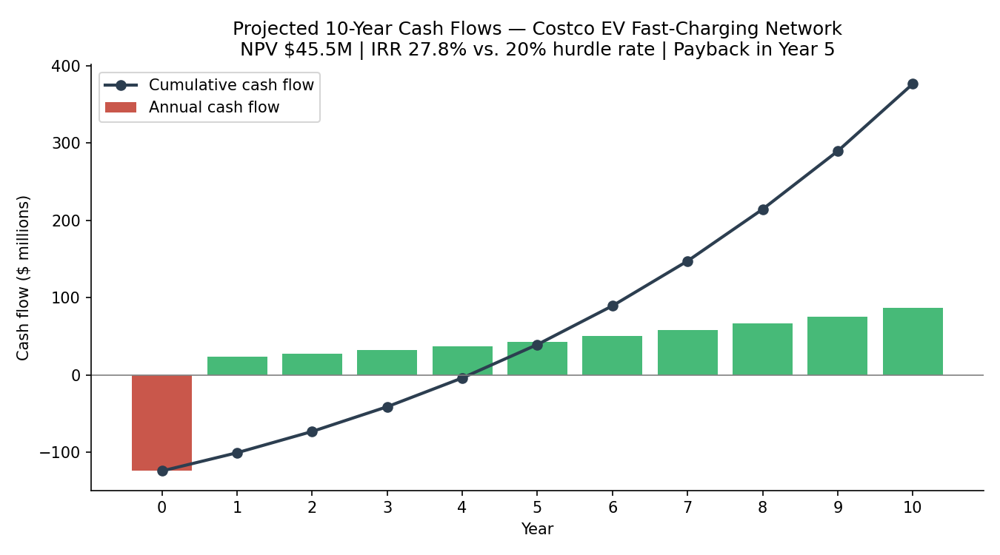

# Costco Strategic Analysis: EV Fast-Charging Network Recommendation

Strategic consulting-style analysis recommending that Costco build a **backward-integrated EV fast-charging network**, beginning with a Southeastern U.S. rollout. Backed by a full 10-year financial model: **$124.2M initial investment, NPV of $45.5M, and a 27.8% IRR against a 20% hurdle rate** with break-even in Year 5.

## Business Problem

Costco's broad cost-leadership model depends on in-store traffic and membership loyalty, but the company faces geographic revenue concentration (86% of revenue from the U.S. and Canada) and rising consumer expectations around EVs and digital convenience. The question: is there a strategic investment that reinforces Costco's core membership value proposition, the way its gasoline business does, while opening a new revenue stream in a high-growth market?

## Approach

1. **Strategy diagnosis:** Assessed Costco's mission, cost-leadership model, and competitive position using SWOT, PESTEL, Porter's Five Forces, and a strategic group map against Sam's Club and BJ's Wholesale.
2. **Recommendation design:** A three-phase, backward-integrated rollout. Costco owns and operates its chargers (private-labeled, no third-party royalties) rather than outsourcing to ChargePoint or Tesla, mirroring the control and margin logic of its Kirkland Signature and gasoline strategies.
3. **Financial modeling (Excel):** Built a 10-year discounted cash flow model (DCF) utilizing calculated assumptions. Assumptions were derived from Wawa's EV deployment and scaled by square footage, Tesla Supercharger throughput data for revenue, Florida electricity rates for variable costs, straight-line depreciation, and 21% tax. Final metrics are NPV and IRR.
4. **Sensitivity analysis:** Conducted best/worst-case scenarios for sales capture rate and growth assumptions; even the worst-case scenario (40% of target sales, 8% growth) keeps the project economically viable.

## Key Numbers

| Metric | Value |
|---|---|
| Initial investment | **$124.2M** (within $150M cash budget, no debt) |
| Chargers deployed | ~2,510 across 81 Southeastern warehouses (~31 per location) |
| Pricing | $0.37/kWh base rate (non-members) & $0.33/kWh member rate, mirroring the gas discount |
| Year 1 sales | $53.5M, growing 13% annually |
| **NPV** | **$45.5M** |
| **IRR** | **27.8% vs. 20% hurdle rate** |

## Key Findings

- **The strategy extends what already works.** EV charging takes Costco's proven gas playbook one step further: a member-discounted commodity that drives trips, deepens loyalty, and monetizes existing real estate. Average charge time (30-60 min) matches average shop time, allowing existing infrastructure and the retail model to reinforce each other.
- **Backward integration is a key choice.** Private-labeling chargers costs ~40% more upfront per unit ($49.5K vs. $34.5K) but eliminates royalties and keeps pricing control in-house. Kirkland Signature employs this integration logic currently. 
- **Membership-model supports EV implementation.** A tiered charging rate converts this project into a retention tool that competitors without a membership model can't replicate. EV chargers are just another value-add for Costco members.
- **The project survives pessimistic outcomes.** Sensitivity analysis shows the project exceeds break-even even when sales capture and growth assumptions are cut roughly in half. This recommendation doesn't depend on best-case scenarios.

## Tools

**Excel**: 10-year DCF model, NPV/IRR analysis, scenario/sensitivity tables. Research compiled from 10-K filings, GlobalData and MarketLine industry profiles, Tesla quarterly reports, and Pew Research consumer data.

## Repository Contents

- [`costco_financial_analysis.xlsx`](costco_financial_analysis.xlsx): full financial model (pro forma, assumptions, and scenario analysis tabs)
- [`costco_recommendation_final_report.pdf`](costco_recommendation_final_report.pdf): complete written report (strategy frameworks, recommendation, financial justification, risk analysis)
- [`images/`](images/): cash flow visualization generated from the model

## Note

Team project completed as part of my strategic management coursework at UCF. 

---

*Jack Griffin · B.S.B.A. Economics, Statistics Minor · University of Central Florida*
